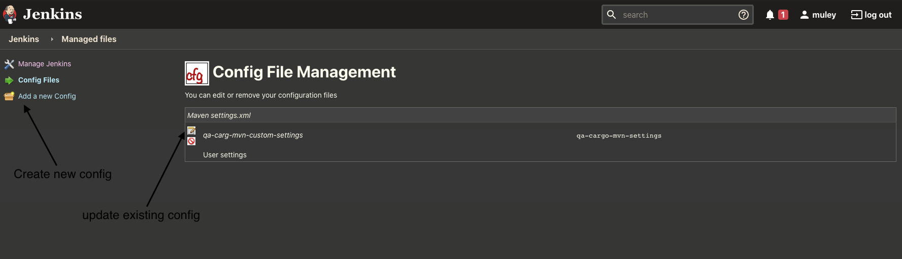
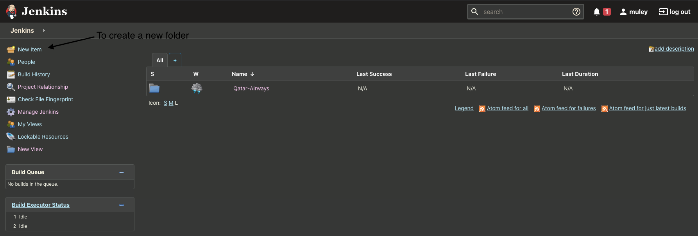
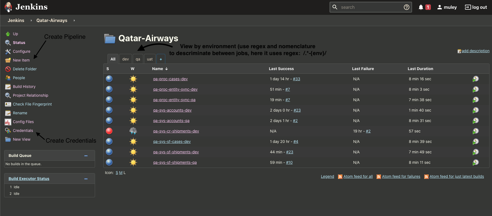
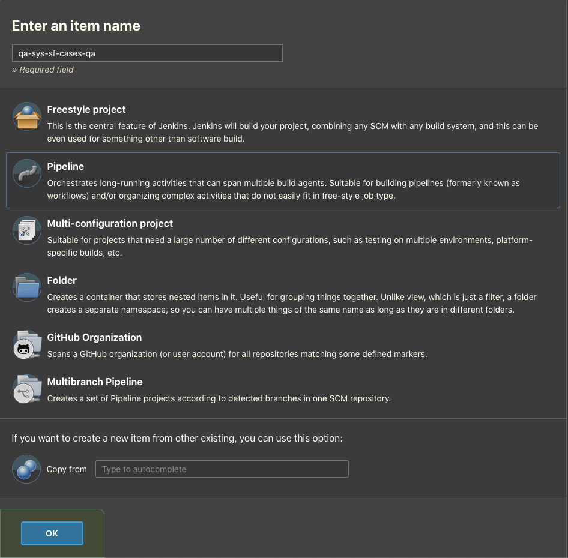

> author : Soufiane Boulealf - MuleSoft

This document describes how to setup Jenkins Server configuration for Qatar Airways Cargo project.

# Summary
- [Summary](#summary)
- [CI/CD Setup](#cicd-setup)
  - [Plugins & Global Configuration](#plugins--global-configuration)
  - [Maven Settings](#maven-settings)
    - [Prerequisite](#prerequisite)
    - [Setup](#setup)
  - [Pipelines](#pipelines)
    - [Organization](#organization)
    - [Create Credentials](#create-credentials)
    - [Create Pipeline](#create-pipeline)


# CI/CD Setup

## Plugins & Global Configuration

Once Jenkins server is up and running, the following plugins and configuration should be applied:

- **Plugins** 
    - **Config File Provider Plugin** needs to be installed, it will allow to manage files, especially the maven's settings.xml file.
- **Global Tool Configuration**
    - **JDK installations** should be configured to use jdk 8. several options are possible here:
      - Use **open jdk installer** plugin (should be installed).
      - Upload a jdk yourself. Downlaod a jdk from oracle's repo. We used this option to setup Jenkins for phase 0 and we installed **Java SE Development Kit 8u192**.
    - **Maven installations** we used the `3.6.3 version` from Apache. 
    - **Git** should be installed on the system and accessible to Jenkins (default)


## Maven Settings

### Prerequisite

In order to build Mule project some packages are required from `nexus` and your organization's `exchange`. Make sure you have access for both. 

### Setup

Go to **Manage Jenkins > Managed files** and click on the **Add a new Config** to create a ne configuration file for maven as shown in the screenshot:

> 

Select **Global Maven settings.xml** and dont forget to change the **ID** to `qa-cargo-mvn-settings` which corresponds to the name used in the Jenkins pipeline script. Give it a name then fill the content with the following configuration file and don't forget to replace your **nexus** credentials, we will set the **exchange** credentials using a different method : 

```xml
<?xml version="1.0" encoding="UTF-8"?>

<settings xmlns="http://maven.apache.org/SETTINGS/1.0.0" 
          xmlns:xsi="http://www.w3.org/2001/XMLSchema-instance" 
          xsi:schemaLocation="http://maven.apache.org/SETTINGS/1.0.0 http://maven.apache.org/xsd/settings-1.0.0.xsd">
  <pluginGroups>
    <pluginGroup>org.mule.tools</pluginGroup>
  </pluginGroups>

  <proxies></proxies>

  <servers>
    <server>
      <id>Exchange2</id>
      <username>~~Token~~</username>
      <password>${env.ACCESS_TOKEN}</password>
    </server>
    <server>
      <id>mule-ee-nexus-releases</id>
      <username> <!!!USERNAME_TO_BE_CHANGED!!!> </username>
      <password> <!!!PWD_TO_BE_CHANGED!!!> </password>
    </server>
  </servers>

  <mirrors></mirrors>

  <profiles>
    <profile>
      <id>Mule</id>
      <activation>
        <activeByDefault>true</activeByDefault>
      </activation>
      <repositories>
        <repository>
          <id>maven-central</id>
          <name>Maven Central</name>
          <url>https://repo1.maven.org/maven2/</url>
          <layout>default</layout>
        </repository>
        <repository>
          <id>mulesoft-releases</id>
          <name>MuleSoft Repository</name>
          <url>http://repository.mulesoft.org/releases/</url>
          <layout>default</layout>
        </repository>
        <repository>
          <id>mulesoft-snapshots</id>
          <name>MuleSoft Snapshots Repository</name>
          <url>http://repository.mulesoft.org/snapshots/</url>
          <layout>default</layout>
        </repository>
        <repository>
          <id>mulesoft-public</id>
          <name>MuleSoft Public Repository</name>
          <url>https://repository.mulesoft.org/nexus/content/repositories/public/</url>
          <layout>default</layout>
        </repository>
        <repository>
          <id>mule-ee-nexus-releases</id>
          <name>Mule EE Repository</name>
          <url>https://repository.mulesoft.org/nexus-ee/content/repositories/releases-ee/</url>
          <layout>default</layout>
          <releases>
            <enabled>true</enabled>
          </releases>
          <snapshots>
            <enabled>true</enabled>
          </snapshots>
        </repository>
        <repository>
          <id>Exchange2</id>
          <name>Anypoint Platform Exchange Repository</name>
          <url>https://maven.eu1.anypoint.mulesoft.com/api/v2/maven</url>
          <layout>default</layout>
        </repository>
      </repositories>
      <pluginRepositories>
        <pluginRepository>
          <id>mulesoft-releases</id>
          <name>mulesoft release repository</name>
          <layout>default</layout>
          <url>http://repository.mulesoft.org/releases/</url>
          <snapshots>
            <enabled>false</enabled>
          </snapshots>
        </pluginRepository>
        <pluginRepository>
          <id>mule-public</id>
          <url>https://repository.mulesoft.org/nexus/content/repositories/releases</url>
        </pluginRepository>
      </pluginRepositories>
    </profile>
  </profiles>
</settings>
```

Save and exit to main screen.

## Pipelines

### Organization

The following a reference to the organization used on the phase 0 setup for Cargo. Fell free to use another configuration : 
  * Pipelines of the same project are grouped in a directory rather than created at the root. Select **New Item** and choose to create a project (freestyle project).
    > 
  * Create your piplines and credentials inside the folder.
    > 


### Create Credentials

The pipeline uses severale types of credentials in order to retrieve code, buid, test and deploy each mule application.

Here are the different credentials needed in order to run a given pipeline: 

  - **Git credentials**
    - description: In order to poll the code it is mandatory to have access to git server. It's simpler and more secure to use ssh using a key-pair. You configure a public key on your github account and use the associated private key on Jenkins. 
    - Credential kind: **SSH Username with private key**
  - **Mule Application Vault Key**
    - description: mule application uses some encrypted properties. the vault key is used to encrypt/decrypt the properties. Each project has its own credential entry for each available environment.
    - Credential kind: **Secret Text**
    - Credential ID Nomenclature: **anypoint.vault.${REPO_NAME}.${ENV}.key**
  - **Anypoint Environment Credentials**
    - description: in order to deploy to anypoint, credentials (client_id, client_secret) for the targeted environment must be configured.
    - Credentials kind: **Secret Text** (for both id/secret)
    - Credentials Id Nomenclature:
      - for the client_id: **anypoint.${ENV}.client_id**
      - for the client_secret: **anypoint.${ENV}.client_secret**
  - **Anypoint Connected App**
    - description: in order to build the project it is mandatory to access exchange repository to retrieve dependencies. The connected app client_id/client_secret should be configured for each environment type (e.g sandbox and production).
    - Credentials kind: **Secret Text** (for both id/secret)
    - Credentials Id Nomenclature:
      - for the client_id: **anypoint.app.${ENV_TYPE}.client_id**
      - for the client_secret: **anypoint.app.${ENV_TYPE}.client_secret**

### Create Pipeline

Go to **New Item** on the left menu. Make sure you are located inside your project folder. 
fill the name of the pipeline following your nomenclature and choose **Pipeline** before hitting **OK**.

  > 

Next, you will have to configure your pipeline, here's the configuration for each *section* that we recommand: 
  - **General** check the following checkboxes:
    - **Discard old build** in orde to activate log rotation for your Jenkins and avoid consuming too much disk space. Choose the number of **days to keep build** and and the **maximum number of builds to keep**.
    - **Do not allow concurrent builds** In order to avoid consuming too much resources and having conflicts on your deployments (since jobs are for a single environment).
  - **Build Triggers** check the following:
    - **Poll SCM** to pull the repository periodically and only trigger builds upon change. The value to enter is based on CRON table, in order to check every minute use `* * * * *`.
  - **Pipeline**
    - Use **Pipeline script from SCM** in order to use the `Jenkinsfile` script that should be located in your root project directory. 
    - Select **Git** as your SCM and fill the following:
      - Enter the the **repository URL** we recommand using ssh type urls
      - Select the private key configured for your project as your **Credentials** 
      - Select the **Branch** corresponding to your job environment.

Apply and Save. Make sure the required credentials are available, otherwise builds will fail. 

***N.B:*** using Poll SCM, pipelines will check the repo periodically and check if there's new changes before triggering a build. If the branch does not exist when a check is triggered, it is mandatory to trigger the build manually (using the left menu or clicky the little arrow next to the pipeline name) after creating the branch in origin (remote git server).
